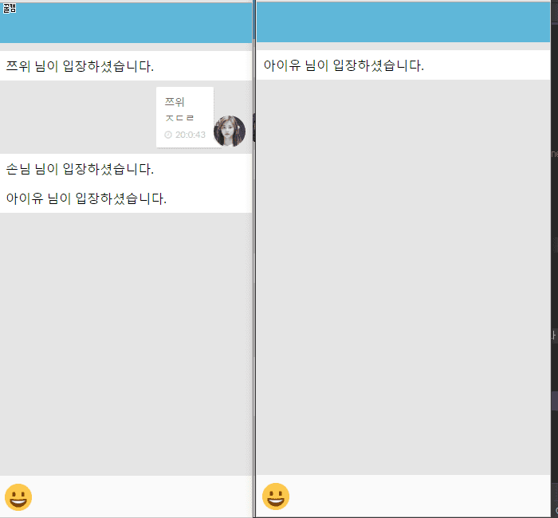

# 하드코딩하는사람들 160521 세미나 발표 자료

## 채팅서비스 라이브코딩

### 환경설정
1. node.js 최신버전 설치
2. bower, live-server 설치 
   npm install -g bower live-server
3. npm install
4. bower install
5. node server.js
6. live-server

